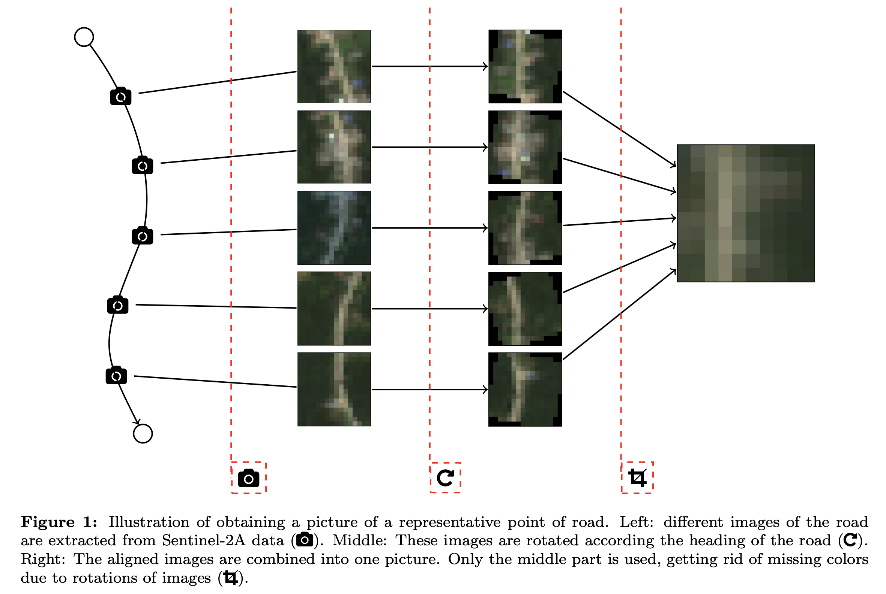

# Data Pre-processing

In this folder, we show how to create the dataset that is used for prediction. We start with the observed data:

First, we add all weather features to the edge data. So each observation of a speed of a truck is now combined with the weather at that point in time (and maybe before). 

Next, we also create a dataframe with all the relevant satellite images. For each road we find a relevant image. To avoid having an image of a not so relevant part of the road (e.g., occluded by trees), we base the image on multiple images of the road of different representative points. This procedure is visualized below:

To do all this, run the files in the following order: 
* [createInputData.py]([https://github.com/valentijnstienen/PredictVelocity/blob/main/Data/createInputData.py]) (first part)
* [createWeatherDB.py]([https://github.com/valentijnstienen/PredictVelocity/blob/main/Data/createWeatherDB.py])
* [createSatelliteDB.py]([https://github.com/valentijnstienen/PredictVelocity/blob/main/Data/createSatelliteDB.py])
* [createInputData.py]([https://github.com/valentijnstienen/PredictVelocity/blob/main/Data/createInputData.py]) (second part)

Note that you can specify various options within each file. 

